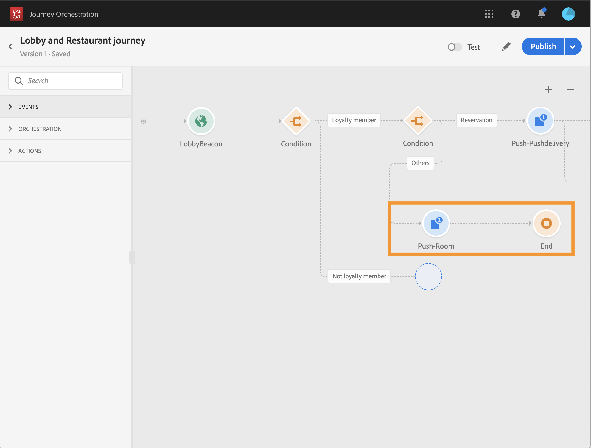

# 构建旅程 {#concept_owm_kdy_w2b}

**业务用户**&#x200B;现在可以构建旅程。我们的旅程将包括以下活动：

* 两个 **[!UICONTROL Event]** 活动：“LobbyBeacon”和“RestaurantBeacon”
* 两个 **[!UICONTROL Condition]** 活动
* 三个 **[!UICONTROL Push]** 活动和一个 **[!UICONTROL Email]** 活动（使用 Adobe Campaign Standard）
* **[!UICONTROL Wait]** 活动
* 四个 **[!UICONTROL End]** 活动

>[!NOTE]
>
>仅当您具有 Adobe Campaign Standard 时，调色板中才提供 **[!UICONTROL Push]** 和 **[!UICONTROL Email]** 活动。

有关如何构建旅程的其他信息，请参阅[](../building-journeys/journey.md)。

## 首要步骤{#section_ntb_ws1_ffb}

1. 在顶部菜单中，单击&#x200B;**[!UICONTROL Home]**&#x200B;选项卡和&#x200B;**[!UICONTROL Create]**&#x200B;以创建新旅程。

   

1. 编辑右侧显示的配置窗格中的旅程属性。添加名称，并将其设置为持续 1 个月（从 12 月 1 日至 31 日）。

   

1. 通过将“LobbyBeacon”事件从调色板拖放到画布，开始设计旅程。您还可以双击调色板中的事件来将其添加到画布。

   

1. 现在，让我们添加条件，以检查过去 24 小时内是否未联系该人员，并检查其是否是忠诚会员。将条件活动拖放到旅程中。

   

1. 选择 **[!UICONTROL Data Source Condition]** 类型，然后在 **[!UICONTROL Expression]** 字段中单击。您还可以定义将在画布中的箭头上显示的条件标签。在示例中，我们将“条件1”替换为“忠诚会员”。

   

1. 单击 **[!UICONTROL Advanced mode]** 并根据来自 Adobe Experience Platform 数据源的“timestamp”和“directMarketing.sends.value”字段定义以下条件。表达式的语法为：

   ```
   count(#{ExperiencePlatformDataSource.MarltonExperience.experienceevent.all(
       currentDataPackField.directMarketing.sends.value > 0 and
       currentDataPackField.timestamp > nowWithDelta(-1, "days")).timestamp}) == 0
   and
       #{ExperiencePlatformDataSource.MarltonProfiles.Profile._customer.marlton.loyaltyMember}
   ```

   

1. 单击 **[!UICONTROL Add a path]** 按钮，并为过去 24 小时内未联系且不是忠诚度会员的客户创建第二个路径。将路径命名为“不忠诚会员”。表达式的语法为：

   ```
   count(#{ExperiencePlatformDataSource.MarltonExperience.experienceevent.all(
       currentDataPackField.directMarketing.sends.value > 0 and
       currentDataPackField.timestamp > nowWithDelta(-1, "days").timestamp}) == 0
   and not
       #{ExperiencePlatformDataSource.MarltonProfiles.Profile._customer.marlton.loyaltyMember}
   ```

   >[!NOTE]
   >
   >在表达式的第二部分中，“用户档案”是可选的。

1. 我们需要选择命名空间。根据模式属性预先选择命名空间。您可以使命名空间保持处于预选状态。有关命名空间的详细信息，请参阅[](../event/selecting-the-namespace.md)。

在我们的用例中，我们只希望对这两种情况做出反应，因此不会选中 **[!UICONTROL Show path for other cases than the one(s) above]** 框。

在您的条件之后将创建两个路径：

* _过去 24 小时内未联系且是忠诚会员的客户。_
* _过去 24 小时内未联系且不是忠诚会员的客户。_


## 第一个路径：客户是忠诚会员 {#section_otb_ws1_ffb}

1. 在第一个路径中，让我们添加条件来检查客户是否有预订。将条件活动拖放到旅程中。

   

1. 选择 **[!UICONTROL Data Source Condition]** 类型，并根据从预订系统中检索到的预订状态信息来定义条件：

   ```
   #{MarltonReservation.MarltonFieldGroup.reservation} == true
   ```

   

1. 从外部数据源中选择字段时，屏幕的右侧部分显示配置外部数据源时定义的参数列表（请参阅[](../usecase/configuring-the-data-sources.md)）。单击参数名称并定义预订系统键（在我们的示例中为 Experience Cloud ID）的值：

   ```
   @{LobbyBeacon.endUserIDs._experience.mcid.id}
   ```

   

1. 由于我们还希望对没有预订的客户做出反应，因此需要选中 **[!UICONTROL Show path for other cases than the one(s) above]** 框。

   

   创建了两个路径：

   * _已预订房间的客户_
   * _未预订房间的客户。_

   

1. 在第一个路径（已预订房间）中，删除 **[!UICONTROL Push]** 活动，选择移动应用程序和“欢迎”模板。

   

1. 定义系统发送推送所需的 **[!UICONTROL Target]** 字段。

   * **[!UICONTROL Push platform]**：选择平台：**[!UICONTROL Apple Push Notification Server]** (Apple) 或 **[!UICONTROL Firebase Cloud Messaging]** (Android)。
   * **[!UICONTROL Registration token]**：使用高级模式添加以下表达式（基于配置的事件）：

      ```
      @{LobbyBeacon._experience.campaign.message.profileSnapshot.pushNotificationTokens.first().token}
      ```

1. 定义推送通知个性化字段。在我们的示例中：名字和姓氏。

1. 添加“RestaurantBeacon”事件。

   

1. 添加新 **[!UICONTROL Push]** 活动，选择“餐饮折扣”模板并定义 **[!UICONTROL Address]** 和 **[!UICONTROL Personalization]** 字段。添加 **[!UICONTROL End]** 活动。

   

1. 我们希望仅当客人在欢迎推送后的 6 小时内进入餐厅时发送餐饮折扣推送通知。为此，我们需要使用等待活动。将光标放在欢迎推送活动上并单击“+”符号。在新路径中，添加等待活动并定义 6 小时的持续时间。将选择第一个符合条件的活动。如果在欢迎推送后不到 6 小时收到餐馆事件，则发送推送活动。如果在未来 6 小时内未收到餐馆事件，则选择等待。在等待活动后放置 **[!UICONTROL End]** 活动。

   

1. 在遵循预订条件（未预订房间）的第二个路径中，添加 **[!UICONTROL Push]** 活动并选择“房费”模板。添加 **[!UICONTROL End]** 活动。

   

## 第二个路径：客户不是忠诚会员{#section_ptb_ws1_ffb}

1. 在遵循第一个条件（客户不是忠诚度会员）的第二个路径中，添加 **[!UICONTROL Email]** 活动并选择“忠诚度会员资格”模板。

   

1. 在 **[!UICONTROL Address]** 字段中，从数据源中选择电子邮件地址。

   

1. 从数据源定义名字和姓氏个性化字段。

   

1. 添加 **[!UICONTROL End]** 活动。

单击 **[!UICONTROL Test]** 切换并测试您的旅程。如果有任何错误，请取消激活测试模式，修改旅程并再次进行测试。有关测试模式的详细信息，请参阅[](../building-journeys/testing-the-journey.md)。


当测试得出结果时，您可以从右上方的下拉菜单发布旅程。


