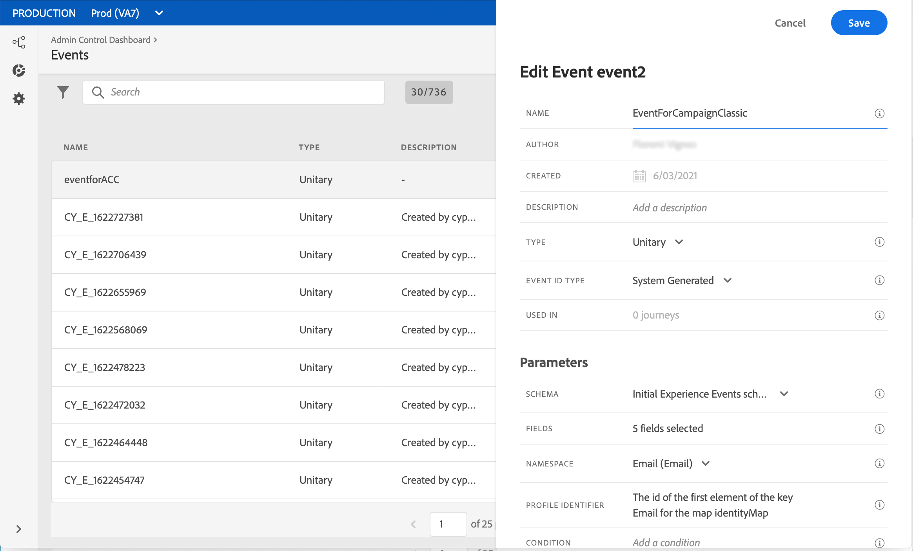
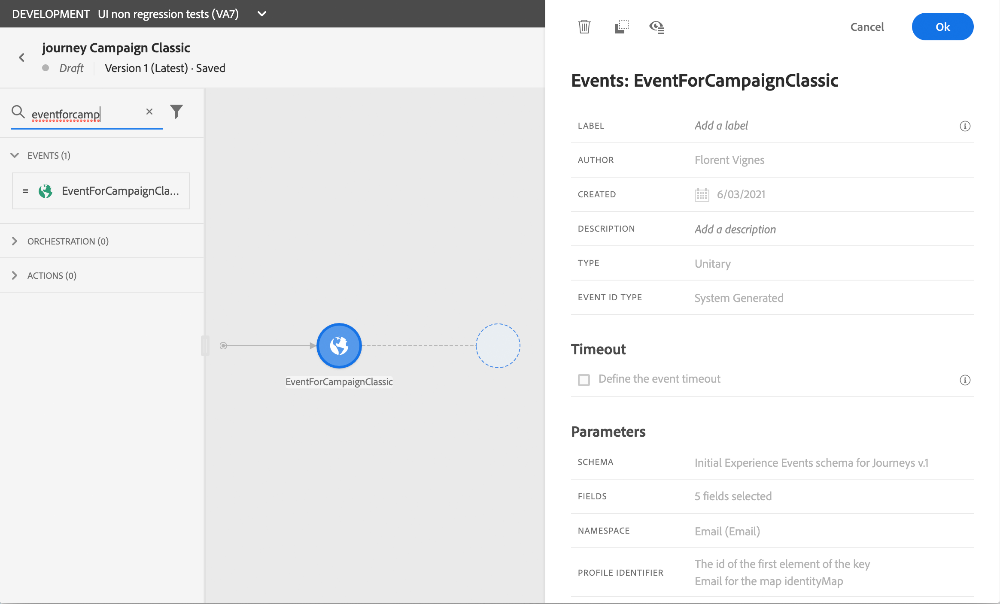

# 使用Campaign Classic{#campaign-classic-use-case}发送消息

此用例介绍使用Adobe Campaign Classic集成发送电子邮件所需的所有步骤。

我们将首先在Campaign Classic中创建事务型电子邮件模板。 然后，在Journey Orchestration中，我们将创建事件、操作并设计历程。

要了解有关Campaign Classic集成的更多信息，请参阅以下页面：

* [创建Campaign Classic操作](../action/acc-action.md)
* [在历程中使用操作](../building-journeys/using-adobe-campaign-classic.md)。

**Adobe Campaign Classic**

您的Campaign Classic实例需要针对此集成进行配置。 需要配置事务型消息传递功能。

1. 登录到您的Campaign Classic控制实例。

1. 在&#x200B;**Administration** > **Platform** > **Enumerations**&#x200B;下，选择&#x200B;**Event type**(eventType)枚举。 创建新事件类型（在我们的示例中为“journey-event”）。 以后编写JSON文件时，必须使用事件类型的内部名称。

   

1. 断开连接并重新连接到实例，以便创建生效。

1. 在&#x200B;**消息中心** > **事务型消息模板**&#x200B;下，根据之前创建的事件类型创建新的电子邮件模板。

   

1. 设计模板。 在此示例中，我们对用户档案的名字和订单号进行个性化设置。 名字在Adobe Experience Platform数据源中，订单号是我们Journey Orchestration事件中的一个字段。 确保在Campaign Classic中使用正确的字段名称。

   

1. 发布事务型模板。

   

1. 现在，您需要编写与模板对应的JSON有效负载。

```
{
     "channel": "email",
     "eventType": "journey-event",
     "email": "Email address",
     "ctx": {
          "firstName": "First name", "purchaseOrderNumber": "Purchase order number"
     }
}
```

* 对于渠道，您需要键入“email”。
* 对于eventType，使用之前创建的事件类型的内部名称。
* 电子邮件地址将为变量，因此您可以键入任何标签。
* 在ctx下，个性化字段也是变量。

**Journey Orchestration**

1. 首先，您需要创建事件。 确保包含“purchaseOrderNumber”字段。

   

1. 然后，您需要在Journey Orchestration中创建与Campaign Classic模板对应的操作。 在&#x200B;**操作类型**&#x200B;下拉列表中，选择&#x200B;**Adobe Campaign Classic**。

   

1. 单击&#x200B;**有效负载字段**&#x200B;并粘贴之前创建的JSON。

   

1. 对于电子邮件地址和两个个性化字段，将&#x200B;**Constant**&#x200B;更改为&#x200B;**Variable**。

   

1. 现在，创建新历程并从之前创建的事件开始。

   

1. 添加操作，并将每个字段映射到Journey Orchestration中的正确字段。

   

1. 添加&#x200B;**结束**&#x200B;活动并测试您的历程。

   

1. 您现在可以发布历程。
