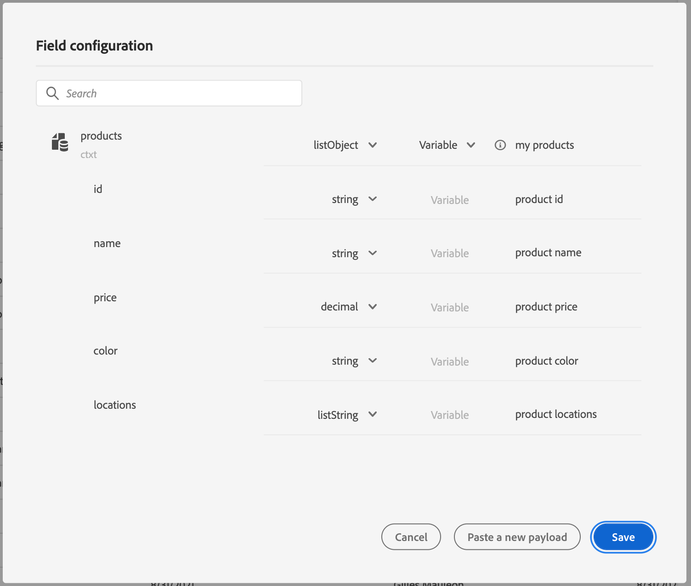

# 使用自定义操作动态传递集合{#passing-collection}

您可以在自定义操作参数中传递集合，这些参数将在运行时动态填充。 支持两种集合：

* 简单集合：简单数据类型的数组，例如，使用listString：

  ```
  {
   "deviceTypes": [
       "android",
       "ios"
   ]
  }
  ```

* 对象集合：由JSON对象组成的数组，例如：

  ```
  {
  "products":[
     {
        "id":"productA",
        "name":"A",
        "price":20.1
     },
     {
        "id":"productB",
        "name":"B",
        "price":10.0
     },
     {
        "id":"productC",
        "name":"C",
        "price":5.99
     }
   ]
  }
  ```

## 限制 {#limitations}

* 目前不支持对象数组中的对象嵌套数组。 例如：

  ```
  {
  "products":[
    {
       "id":"productA",
       "name":"A",
       "price":20,
       "locations": [{"name": "Paris"}, {"name": "London"}]
    },
   ]
  }
  ```

* 要使用测试模式测试收藏集，您需要使用代码视图模式。 当前业务事件不支持代码视图模式。 您只能发送一个包含单个元素的集合。

## 一般程序 {#general-procedure}

在此部分中，我们将使用以下JSON有效负载示例。 这是一个对象数组，其中的字段是一个简单的集合。

```
{
  "ctxt": {
    "products": [
      {
        "id": "productA",
        "name": "A",
        "price": 20.1,
        "color":"blue",
        "locations": [
          "Paris",
          "London"
        ]
      },
      {
        "id": "productB",
        "name": "B",
        "price": 10.99
      }
    ]
  }
}
```

您可以看到，“products”是由两个对象组成的数组。 您需要至少具有一个对象。

1. 创建自定义操作。 请参阅[此页](../action/about-custom-action-configuration.md)。

1. 在 **[!UICONTROL Action parameters]** 部分，粘贴JSON示例。 显示的结构是静态的：粘贴有效负载时，所有字段都定义为常量。

   

1. 如果需要，请调整字段类型。 集合支持以下字段类型：listString、listInteger、listDecimal、listBoolean、listDateTime、listDateTimeOnly、listDateOnly、listObject

   >[!NOTE]
   >
   >根据有效负载示例自动推断字段类型。

1. 如果要动态传递对象，则需要将它们设置为变量。 在此示例中，我们将“products”设置为变量。 对象中包含的所有对象字段都会自动设置为变量。

   >[!NOTE]
   >
   >有效负载示例的第一个对象用于定义字段。

1. 对于每个字段，定义将在历程画布中显示的标签。

   

1. 创建历程并添加您创建的自定义操作。 请参阅[此页](../building-journeys/using-custom-actions.md)。

1. 在 **[!UICONTROL Action parameters]** 部分，使用高级表达式编辑器定义数组参数（在本例中为“products”）。

   

1. 对于以下每个对象字段，键入源XDM架构中的相应字段名称。 如果名称相同，则不需要此操作。 在我们的示例中，我们只需要定义“product id”和“color”。

   

对于数组字段，您还可以使用高级表达式编辑器执行数据操作。 在以下示例中，我们使用 [筛选](../functions/functionfilter.md) 和 [相交](../functions/functionintersect.md) 函数：


## 特定案例{#examples}

对于异构类型和阵列阵列，使用listAny类型定义阵列。 只能映射单个项，但不能将数组更改为变量。


异质类型示例：

```
{
    "data_mixed-types": [
        "test",
        "test2",
        null,
        0
    ]
}
```

阵列示例：

```
{
    "data_multiple-arrays": [
        [
            "test",
            "test1",
            "test2"
        ]
    ]
}
```

**相关主题**

[使用自定义操作](../building-journeys/using-custom-actions.md)
