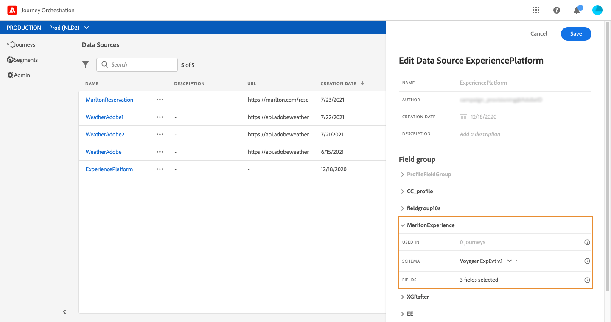
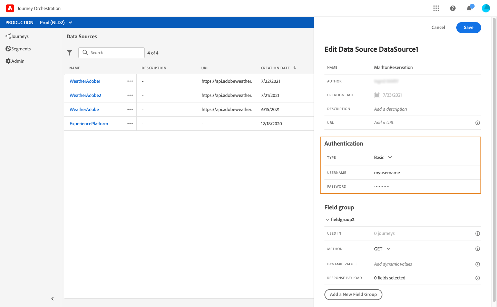

# 配置数据源 {#concept_vml_hdy_w2b}


>[!CAUTION]
>
>**正在查找Adobe Journey Optimizer**？ 单击[此处](https://experienceleague.adobe.com/zh-hans/docs/journey-optimizer/using/ajo-home){target="_blank"}获取Journey Optimizer文档。
>
>
>_本文档参考已被Journey Optimizer替换的旧版Journey Orchestration资料。 如果您对访问Journey Orchestration或Journey Optimizer有任何疑问，请联系您的帐户团队。_


在我们的用例中，我们希望为消息使用个性化数据。 我们还需要检查此人是否为忠诚会员，以及是否在过去24小时内未与其联系。 此信息存储在Real-time Customer Profile数据库中。 **技术用户**&#x200B;需要配置Adobe Experience Platform数据源以检索这些字段。

有关数据源配置的其他信息，请参阅[此页面](../datasource/about-data-sources.md)。

1. 在菜单窗格中，选择&#x200B;**[!UICONTROL Admin]**。 在&#x200B;**[!UICONTROL Data sources]**&#x200B;部分中，单击&#x200B;**[!UICONTROL Manage]**。
1. 选择内置的Adobe Experience Platform数据源。

   

1. 在预配置的组字段中，检查是否选择了以下字段：

   * _人员>姓名>名字_
   * _人员>姓名>姓氏_
   * _个人电子邮件>地址_

1. 单击&#x200B;**[!UICONTROL Add a New Field Group]**，选择一个&#x200B;**[!UICONTROL Profiles]**&#x200B;架构并添加&#x200B;**忠诚度成员**&#x200B;字段作为我们的条件。 **忠诚度成员**&#x200B;字段是一个自定义字段，已添加在XDM中：“_customer > marlton > loyaltyMember”

   

1. 单击&#x200B;**[!UICONTROL Add a New Field Group]**，选择一个&#x200B;**[!UICONTROL ExperienceEvent]**&#x200B;架构并选择条件所需的字段来指定时段内发送的消息数：_时间戳_&#x200B;表示日期，_directMarketing >发送>值_&#x200B;表示发送的消息数。

   

1. 单击 **[!UICONTROL Save]**。

我们还需要检查客人是否在酒店预订系统中有预订。 **技术用户**&#x200B;需要配置第二个数据源以检索此字段。

1. 在数据源列表中，单击&#x200B;**[!UICONTROL Add]**&#x200B;以添加新的外部数据源以定义与您的酒店预订系统的连接。

   

1. 输入数据源的名称和外部服务的URL，例如： _https://marlton.com/reservation_

   >[!CAUTION]
   >
   >出于安全原因，我们强烈建议使用HTTPS。

1. 根据外部服务配置以配置身份验证：**[!UICONTROL No authentication]**、**[!UICONTROL Basic]**、**[!UICONTROL Custom]** 或&#x200B;**[!UICONTROL API key]**。在我们的示例中，我们为类型选择“基本”，并指定API调用的用户名和密码。

   

1. 单击&#x200B;**[!UICONTROL Add a New Field Group]**&#x200B;以定义要检索的信息和API参数。 在我们的示例中，只有一个参数(id)，因此我们需要创建一个包含以下信息的字段组：

   * **[!UICONTROL Method]**：选择 POST 或 GET 方法。在我们的示例中，我们选择 GET 方法。
   * **[!UICONTROL Response Payload]**：单击&#x200B;**[!UICONTROL Payload]**&#x200B;字段并粘贴有效负载示例。 验证字段类型是否正确。每次调用 API 时，系统将检索有效负载示例中包含的所有字段。在我们的示例中，有效负载仅包含保留状态：

   ```
   {
       "reservation" : true
   }
   ```

   * **[!UICONTROL Dynamic Values]**：输入与用于标识每个客户的键对应的参数，在我们的示例中为“id”。 此参数的值将在历程中定义。

   

1. 单击 **[!UICONTROL Save]**。

   数据源现已配置完毕，可随时用于您的旅程。
