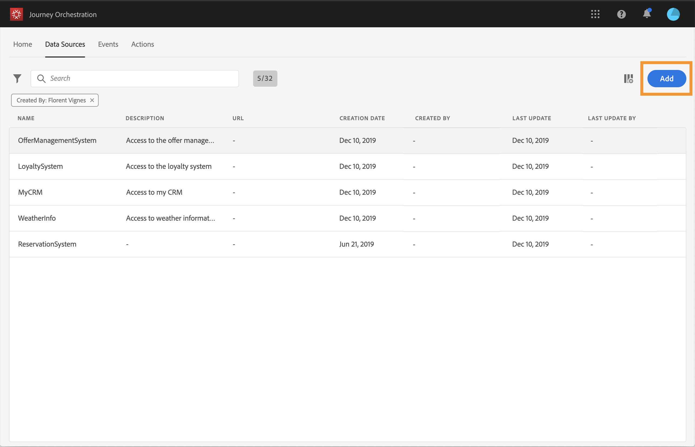

# 配置数据源 {#concept_vml_hdy_w2b}

在我们的用例中，我们希望为消息使用个性化数据。 我们还需要检查此人是否是忠诚会员，以及是否在过去24小时内未与其联系。 此信息存储在Real-time Customer Profile数据库中。 此 **技术用户** 需要配置Adobe Experience Platform数据源以检索这些字段。

有关数据源配置的其他信息，请参阅 [此页面](../datasource/about-data-sources.md).

1. 在菜单窗格中，选择 **[!UICONTROL Admin]**. 在 **[!UICONTROL Data sources]** 部分中，单击 **[!UICONTROL Manage]**。
1. 选择内置的Adobe Experience Platform数据源。

   

1. 在预配置的组字段中，检查是否选择了以下字段：

   * _人员>姓名>名字_
   * _人员>姓名>姓氏_
   * _personalEmail >地址_

1. 单击 **[!UICONTROL Add a New Field Group]**，选择一个 **[!UICONTROL Profiles]** 架构并添加 **忠诚会员** 这是我们的条件对应的字段。 此 **忠诚会员** 字段是一个自定义字段，添加在XDM中：&quot;_customer > marlton > loyaltyMember&quot;

   

1. 单击 **[!UICONTROL Add a New Field Group]**，选择一个 **[!UICONTROL ExperienceEvent]** 架构，并根据在给定时段内发送的消息数选择我们的条件所需的字段： _时间戳_ 日期和 _directMarketing >发送>值_ 用于已发送的消息数。

   

1. 单击 **[!UICONTROL Save]**。

我们还需要检查客人在酒店预订系统中是否有预订。 此 **技术用户** 需要配置第二个数据源以检索此字段。

1. 在数据源列表中，单击 **[!UICONTROL Add]** 添加新的外部数据源以定义与您的酒店预订系统的连接。

   

1. 输入数据源的名称和外部服务的URL，例如： _https://marlton.com/reservation_

   >[!CAUTION]
   >
   >出于安全原因，我们强烈建议使用 HTTPS。

1. 根据外部服务配置以配置身份验证：**[!UICONTROL No authentication]**、**[!UICONTROL Basic]**、**[!UICONTROL Custom]** 或&#x200B;**[!UICONTROL API key]**。在我们的示例中，我们为类型选择“基本”，并指定API调用的用户名和密码。

   

1. 单击 **[!UICONTROL Add a New Field Group]** 定义要检索的信息和API参数。 在我们的示例中，只有一个参数(id)，因此我们需要创建一个包含以下信息的字段组：

   * **[!UICONTROL Method]**：选择 POST 或 GET 方法。在我们的示例中，我们选择 GET 方法。
   * **[!UICONTROL Response Payload]**：在 **[!UICONTROL Payload]** 字段并粘贴有效负载示例。 验证字段类型是否正确。每次调用 API 时，系统将检索有效负载示例中包含的所有字段。在我们的示例中，有效负载仅包含预订状态：

   ```
   {
       "reservation" : true
   }
   ```

   * **[!UICONTROL Dynamic Values]**：输入与用于标识每个客户的键对应的参数，在本例中为“id”。 此参数的值将在历程中定义。

   

1. 单击 **[!UICONTROL Save]**。

   数据源现已配置完毕，可随时用于您的旅程。
