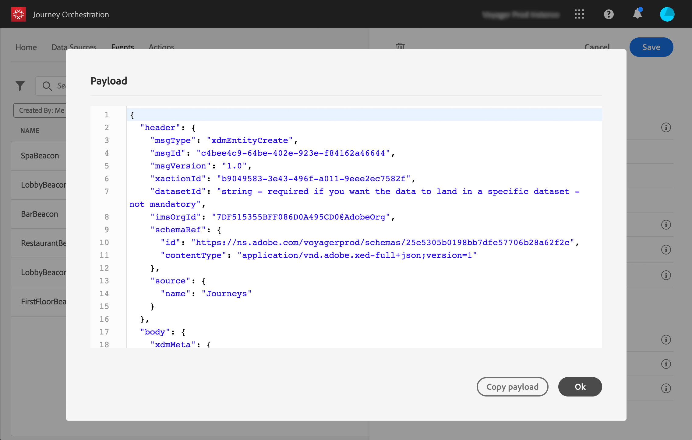

# 配置活动{#concept_y44_hcy_w2b}

在我们的场景中，每当一个人在位于Spa旁的信标附近走动时，我们都需要收到一个活动。 技 **术用户需要配置** ，系统将在我们的旅程中侦听的事件。

有关活动配置的其他信息，请参阅 。

1. 在顶部菜单中，单击选 **[!UICONTROL Events]**项卡并单**[!UICONTROL Add]** 击以创建新活动。

   

1. 我们输入名称时不带空格或特殊字符：“SpaBeacon”。

   

   <!--li>Select the **[!UICONTROL Mobile - Streaming Ingestion APIs]** event type. Events are sent from the customers' mobile phone through the Mobile SDK.。 推送事件的系统不应生成ID，它应使用有效负荷预览中可用的ID。 在我们的用例中，此ID用于标识信标位置。 每当某人在spa信标附近行走时，将发送包含此特定事件ID的活动。 这使系统能够了解触发事件发送的信标。

   

   >[!NOTE]
   >
   >字段列表因架构而异。 根据架构定义，某些字段可能是必填的并且是预先选择的。

1. 我们需要选择一个命名空间。 将根据架构属性预先选择命名空间。 您可以保持预选。 有关命名空间的详细信息，请参 阅。

   

1. 根据架构属性和选定的命名空间预选键。 你可以留着它。

   

1. 单击 **[!UICONTROL Save]**.

1. 单击该 **[!UICONTROL View Payload]**图标可预览系统预期的有效负荷，并将其共享给负责事件发送的人员。 此负载需要在Mobile services管理控制台的回传中配置。

   

   该活动已准备好用于您的旅程。 您现在需要配置移动应用程序，以便它能够将期望的有效负荷发送到流摄取API端点。 请参见 。