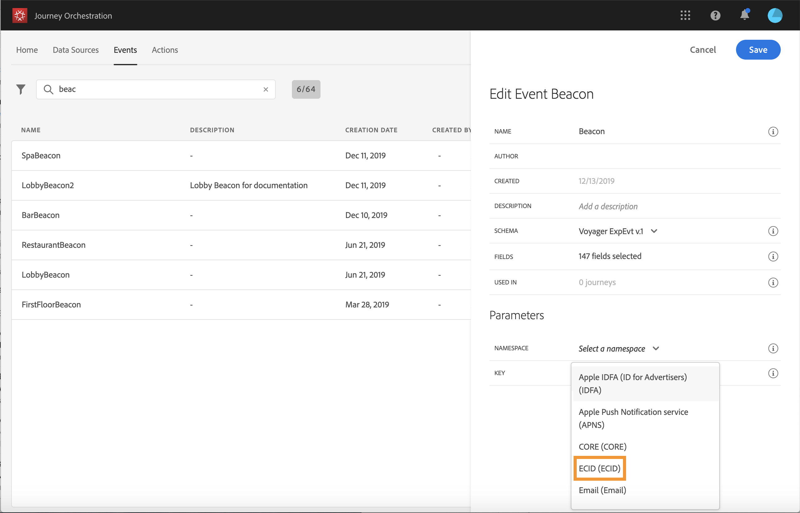

# 配置事件 {#concept_sbp_5cy_w2b}

在我们的场景中，我们需要在每次有人进入马尔顿酒店和餐厅时收到一个事件。 **技术用户**&#x200B;需要配置我们希望系统在历程中侦听的两个事件。

有关事件配置的其他信息，请参阅[此页面](../event/about-events.md)。

1. 在顶部菜单中，单击&#x200B;**[!UICONTROL Events]**&#x200B;选项卡，然后单击&#x200B;**[!UICONTROL Add]**&#x200B;以创建新事件。

   

1. 我们输入名称，名称中不包含空格或特殊字符：“LobbyBeacon”。

   

1. 然后，我们选择架构并定义此事件所需的有效负载。 我们从XDM标准化模型中选择所需的字段。 我们需要Experience CloudID来识别实时客户档案数据库中的人员：“endUserIDs > _experience > mcid > id”。

   我们还需要注册令牌以发送推送消息：&quot;_experience > campaign >消息>用户档案> pushNotificationTokens >令牌&quot;

   系统会自动为此事件生成ID。 此ID存储在&#x200B;**[!UICONTROL eventID]**&#x200B;字段中(“_experience > campaign > orchestration > eventID”)。 推送事件的系统不应生成ID，它应使用有效负载预览中可用的ID。 在我们的用例中，此ID用于标识信标位置。 每次有人靠近大厅信标时，都会发送一个包含此特定事件ID的事件。 同一原则适用于餐厅信标事件。 这允许系统知道哪些信标触发了事件发送。

   

   >[!NOTE]
   >
   >字段列表因架构而异。 根据架构定义，某些字段可能是必填字段，并且已预先选择。

1. 我们需要选择命名空间。根据模式属性预先选择命名空间。您可以使命名空间保持处于预选状态。有关命名空间的更多信息，请参阅[此页面](../event/selecting-the-namespace.md)。

   

1. 根据模式属性和选定的命名空间预先选择密钥。 你可以留着它。

   

1. 单击 **[!UICONTROL Save]**。

1. 单击&#x200B;**[!UICONTROL View Payload]**&#x200B;图标可预览系统期望的有效负载，并将其共享给负责事件发送的人员。  此有效负载需要在Mobile Services管理控制台的回发中进行配置。

   

同样，创建“RestaurantBeacon”事件。 您的两个Beacon事件已创建，现在可以在我们的历程中使用。 您现在需要配置移动应用程序，以便能够将预期的有效负载发送到流摄取API端点。 请参阅[此页](../event/additional-steps-to-send-events-to-journey-orchestration.md)。
