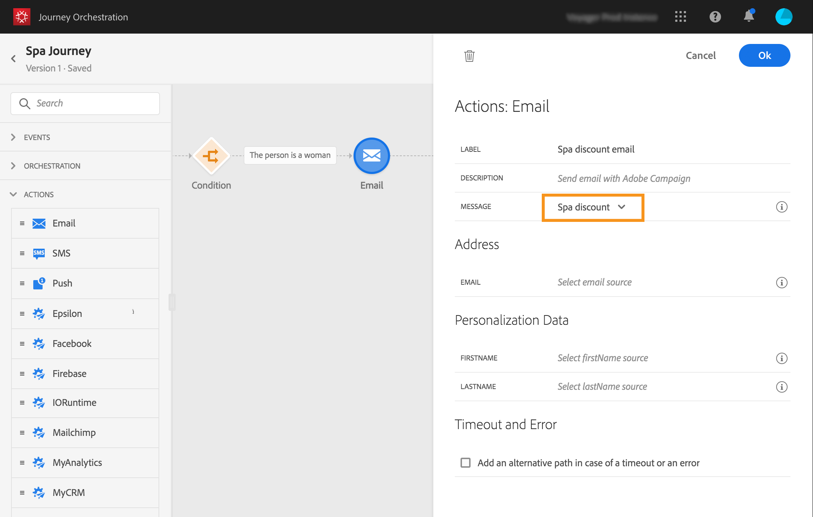

# 构建历程{#concept_eyw_mcy_w2b}

**业务用户**&#x200B;现在可以构建历程。我们的历程将仅包含一个包含以下活动的路径：

* &quot;SpaBeacon&quot; **[!UICONTROL Event]**:当人员在spa信标附近行走时，系统将收到一个事件，并且该人员的历程将开始。
* **[!UICONTROL Condition]**&#x200B;活动，用于检查此人是否为女性
* **[!UICONTROL Email]**&#x200B;活动(使用Adobe Campaign Standard)
* **[!UICONTROL End]**&#x200B;活动

>[!NOTE]
>
>仅当您具有 Adobe Campaign Standard 时，调色板中才提供 **[!UICONTROL Push]** 和 **[!UICONTROL Email]** 活动。

有关如何构建历程的其他信息，请参阅[此页面](../building-journeys/journey.md)。

1. 在顶部菜单中，单击&#x200B;**[!UICONTROL Home]**&#x200B;选项卡和&#x200B;**[!UICONTROL Create]**&#x200B;以创建新历程。

   

1. 编辑右侧显示的配置窗格中的历程属性。我们将其命名为“Spa历程”，并将其设置为持续一个月，从12月1日到31日。

   

1. 通过将“SpaBeacon”事件从面板拖放到画布，开始设计历程。 您还可以双击调色板中的事件来将其添加到画布。

   

1. 现在，让我们添加一个条件来检查此人是否为女性。 将条件活动拖放到历程中。

   

1. 选择 **[!UICONTROL Data Source Condition]** 类型，然后在 **[!UICONTROL Expression]** 字段中单击。您还可以定义将在画布中的箭头上显示的条件标签。

   

1. 使用简单的表达式编辑器，查找性别字段(_person > gender_)，并将其放置到创建以下条件的权限中：&quot;性别等于&quot;女性&quot;。

   

1. 删除&#x200B;**[!UICONTROL Email]**&#x200B;活动，并选择“Spa discount”事务型消息传递模板。 此模板是使用Adobe Campaign设计的。 请参见此[页面](https://experienceleague.adobe.com/docs/campaign-standard/using/communication-channels/transactional-messaging/getting-started-with-transactional-msg.html?lang=zh-Hans)。

   

1. 在&#x200B;**[!UICONTROL Email]**&#x200B;字段内单击，然后从数据源中选择电子邮件地址。

   

1. 同样，从数据源定义名字和姓氏个性化字段。

   

1. 删除&#x200B;**[!UICONTROL End]**&#x200B;活动。

   

1. 单击&#x200B;**[!UICONTROL Test]**&#x200B;切换开关，然后使用测试用户档案测试您的历程。 如果有任何错误，请取消激活测试模式，修改历程并再次进行测试。有关测试模式的更多信息，请参阅[此页面](../building-journeys/testing-the-journey.md)。

   

1. 当测试得出结果时，您可以从右上方的下拉菜单发布历程。

   

下次，当一位女士在Spa信标附近散步时，她会立即收到一封“Spa折扣”个性化电子邮件。
