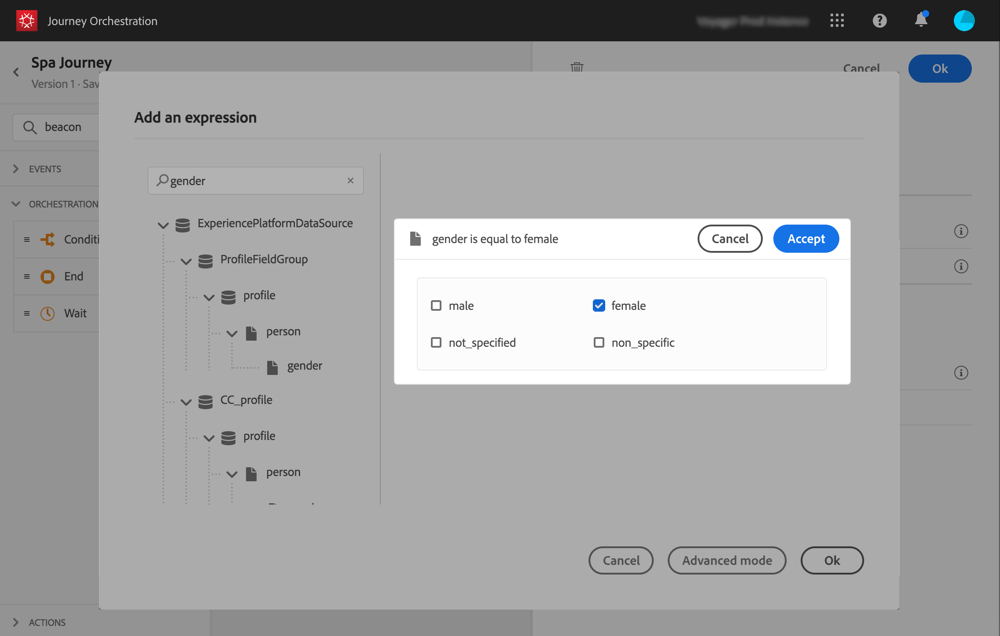

# 构建历程{#concept_eyw_mcy_w2b}

**业务用户**&#x200B;现在可以构建历程。我們的歷程將僅包含一個包含以下活動的路徑：

* 「SpaBeacon」 **[!UICONTROL Event]**：當有人接近spa信標時，系統將會收到事件，且會為該人開始歷程。
* a **[!UICONTROL Condition]** 活動以檢查該人員是否為女性
* 一個 **[!UICONTROL Email]** 活動(使用Adobe Campaign Standard)
* 一個 **[!UICONTROL End]** 活動

>[!NOTE]
>
>仅当您具有 Adobe Campaign Standard 时，调色板中才提供 **[!UICONTROL Push]** 和 **[!UICONTROL Email]** 活动。

有关如何构建历程的其他信息，请参阅[此页面](../building-journeys/journey.md)。

1. 在顶部菜单中，单击&#x200B;**[!UICONTROL Home]**&#x200B;选项卡和&#x200B;**[!UICONTROL Create]**&#x200B;以创建新历程。

   

1. 编辑右侧显示的配置窗格中的历程属性。我們將其命名為「Spa journey」，並將其設定為持續一個月（從12月1日至31日）。

   

1. 從浮動視窗拖放「SpaBeacon」事件至畫布，開始設計您的歷程。 您还可以双击调色板中的事件来将其添加到画布。

   

1. 現在新增條件，以檢查該人員是否為女性。 将条件活动拖放到历程中。

   

1. 选择 **[!UICONTROL Data Source Condition]** 类型，然后在 **[!UICONTROL Expression]** 字段中单击。您还可以定义将在画布中的箭头上显示的条件标签。

   

1. 使用簡單運算式編輯器，尋找性別欄位(_人員>性別_)，並拖曳至右側以建立下列條件：「性別等於」女性。

   

1. 放置 **[!UICONTROL Email]** 活動並選取您的「Spa折扣」交易式訊息範本。 此範本是使用Adobe Campaign設計的。 請參閱此 [頁面](https://experienceleague.adobe.com/docs/campaign-standard/using/communication-channels/transactional-messaging/getting-started-with-transactional-msg.html?lang=zh-Hans).

   

1. 按一下 **[!UICONTROL Email]** 欄位並從資料來源選取電子郵件地址。

   

1. 以相同方式，從資料來源定義名字和姓氏個人化欄位。

   

1. 放置 **[!UICONTROL End]** 活動。

   

1. 按一下 **[!UICONTROL Test]** 使用測試設定檔切換及測試您的歷程。 如果有任何错误，请取消激活测试模式，修改历程并再次进行测试。有关测试模式的更多信息，请参阅[此页面](../building-journeys/testing-the-journey.md)。

   

1. 当测试得出结果时，您可以从右上方的下拉菜单发布历程。

   

下次當女性在Spa指標附近散步時，會立即收到「Spa折扣」個人化電子郵件。
